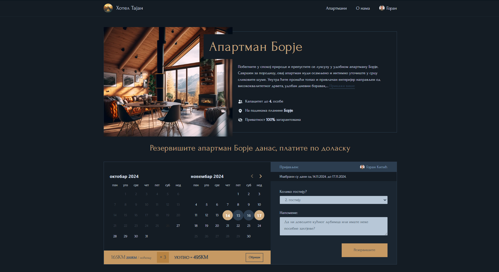
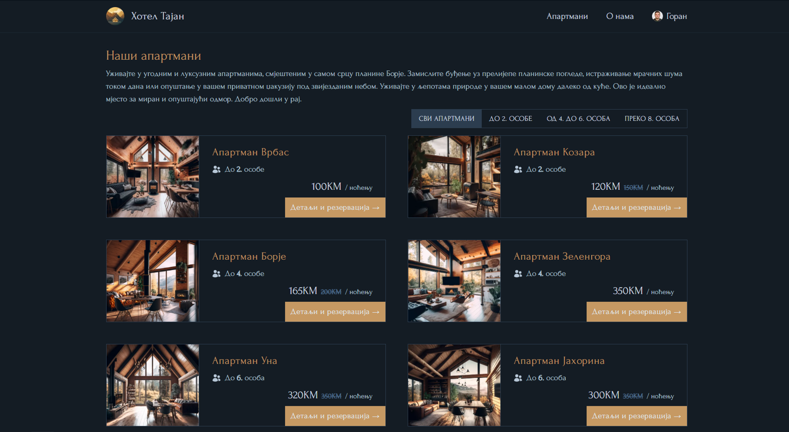
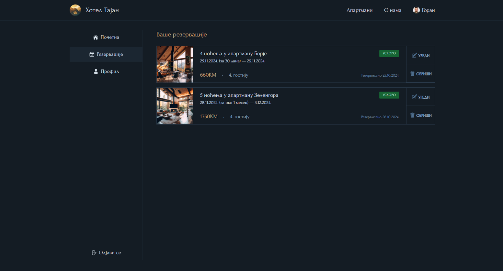

# 🌲 Hotel Tajan

Hotel Tajan is a studen project and a simple full-stack application create in process of learning Next.js, React, Prisma ORM, and TailwindCSS.
Guest can register to the application, find apartman, pick free days, and create a reservation.

⌨️ Practicing & learning: Fetching data, SSR, client and server interactions, data mutations with server actions,

©️ 2024 Goran Kitic

